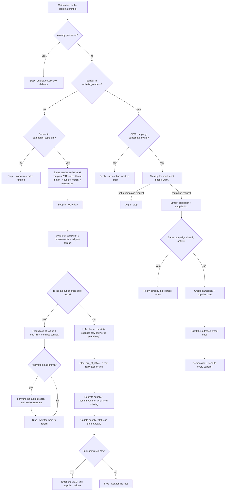

# The Coordinator Pipeline — How One Email Turns Into Action

This document explains **[pipeline.py](pipeline.py)** — the part of the system that decides
what to do every time a mail lands in the coordinator's inbox. It assumes no prior
knowledge of this codebase. For how the inbox itself is connected (AgentMail / Gmail /
Microsoft 365, webhooks, deployment), see [README.md](README.md).

---

## 1. What this service actually does, in one paragraph

Companies ("OEMs") email one shared inbox — the **coordinator** — asking it to go
collect information from a list of suppliers (e.g. "get 2025 emissions data from
these 5 suppliers"). The coordinator reads that request, figures out who the
suppliers are and what's being asked for, emails every supplier on the list, and then
tracks every reply that comes back — deciding whether each supplier has answered
fully, chasing them if not, and telling the OEM once a supplier is done. All of this
happens automatically, with no human reading or writing the emails by hand.

---

## 2. The big picture

Everything below expands each box.

---

## 3. Glossary — the five things the database keeps track of

Think of this like a filing cabinet with five drawers. A supplier's reply always
knows which campaign it belongs to, and a campaign always knows which OEM company
asked for it.

| Table | Plain-English meaning | Example |
|---|---|---|
| `oem_companies` | A paying customer organisation, with a subscription window (`started_at` → `ended_at`). | "Acme Motors", subscribed until 2026-12-31 |
| `whitelist_senders` | The specific people at an OEM company who are *allowed* to ask the coordinator to start work. Anyone else emailing in is ignored (unless they're a known supplier — see below). | jane@acmemotors.com, active |
| `campaigns` | One outreach request: a title, who asked for it (`org_email`), and the requirement details (`summary` — objective, instructions, deadline). | "2025 Emissions Data Collection" |
| `campaign_suppliers` | One row per supplier that a campaign is chasing, plus how far along they are (`status`: pending → in_progress → completed), what they've provided so far (`response_summary`), and — while they're away — an `out_of_office` flag, `ooo_till`, and an `alternate_*` contact to route to instead. | john@abcmanufacturing.com, status=in_progress |
| `email_conversations` | Every single email, in either direction, tied back to the campaign and supplier it belongs to. This *is* the audit trail / thread history. | "IN: john@abc... sent Scope 1 numbers" |

Full column definitions live in [db/dbmodel.py](db/dbmodel.py).

---

## 4. Step-by-step: what happens to an inbound mail

Entry point: `pipeline.process(msg, provider, coordinator_address)`, called by every
provider's webhook handler right after it fetches and marks a message as read (see
e.g. [providers/agentmail.py:126](providers/agentmail.py#L126)).

### Step 0 — Don't process the same mail twice
Every provider can occasionally redeliver the same webhook. `_already_processed()`
([pipeline.py:305](pipeline.py#L305)) checks whether this exact `message_id` was
already logged as an incoming mail; if so, the whole thing stops immediately.

### Step 1 — Who is this person?
The sender's address is looked up in `whitelist_senders`
([pipeline.py:316](pipeline.py#L316)). Two outcomes:

- **Found** → this is a known OEM staff member, continue at Step 2.
- **Not found** → they might still be a **supplier** replying to a campaign they
  were sent (suppliers are never whitelisted — they didn't ask to be contacted), or
  their named **out-of-office alternate** replying on their behalf.
  `_supplier_row()` ([pipeline.py:398](pipeline.py#L398)) checks `campaign_suppliers`
  for active rows matching either `user_email` or `alternate_email`. Found → jump
  straight to the **[Supplier-reply flow](#6-the-supplier-reply-flow)** below and
  stop here. Not found either → the mail is from a completely unknown address and is
  silently ignored.

  **The same email can be an active supplier in more than one campaign at once** -
  e.g. xyz@gmail.com is being chased by both a 2025 emissions campaign and a
  separate compliance-documents campaign. `_supplier_row()` resolves which one an
  incoming mail belongs to in priority order (see `_supplier_candidates()`,
  [pipeline.py:386](pipeline.py#L386)):
    1. **Exact thread match** - the mail's `thread_id`, or its `in_reply_to`
       matching a `message_id` already logged, lines up with an
       `email_conversations` row belonging to one of the candidate campaigns.
    2. **Subject match** - if there's no thread/reply-to to go on, the mail's
       subject (with `Re:` / `Fwd:` / `Fw:` prefixes stripped) is compared against
       each candidate's campaign title.
    3. **Fallback** - the most recently assigned candidate (`assigned_at DESC`),
       used when neither of the above resolves it (e.g. a supplier starting a fresh
       email instead of replying in-thread).
  Every resolution - including "only one active campaign, no ambiguity" - is logged
  with which tier matched and which campaign/supplier it landed on, so any
  misattribution is traceable after the fact rather than silent.

### Step 2 — Does this OEM company have an active subscription?
Every `oem_companies` row has a subscription window. If it's expired or hasn't
started yet, the coordinator does no work and just replies explaining that
(`subscription_inactive_email` in [templates.py](templates.py)) — no LLM involved,
this is a fixed template. ([pipeline.py:642](pipeline.py#L642))

### Step 3 — What is this email actually asking for?
This is the first point an AI model gets involved. The **`email_purpose_check`**
agent reads the mail and classifies it as one of: `campaign_create`, `task`,
`supplier_reply`, `question`, or `other`. Only `campaign_create` and `task` continue
past this point — everything else is just logged and the pipeline stops.
([pipeline.py:658](pipeline.py#L658))

### Step 4 — Turn the email into a structured campaign
The **`campaign_create`** agent reads the same email and extracts: a title, the
requirement details (objective / instructions / deadline — kept *fact-only*, no
names), the Cc and Bcc addresses to carry on every mail this campaign sends, and the
list of suppliers to contact (name, email, company, phone — whatever was mentioned).
([pipeline.py:669](pipeline.py#L669)) Bcc is captured the same way Cc is, but in
practice it will almost always come back empty - see the Bcc caveat in
[§7b](#7b-cc--bcc-on-every-outbound-mail).

### Step 4b — Is this the same request as one already running?
Before creating anything, the pipeline checks: does this same OEM company already
have an **active** campaign with the same title or the same objective?
(`_find_active_duplicate()`, [pipeline.py:364](pipeline.py#L364)) If yes, no new
campaign is created and no suppliers are re-contacted — the OEM sender just gets a
reply saying the request is already in progress. This exists specifically so that
resending the same request by accident (or a habit of following up) doesn't spam
every supplier with a second, parallel outreach email.

Once that campaign finishes (`is_active` turns false), the same request is free to
start a new campaign again — useful for requests that repeat periodically, like an
annual data collection.

### Step 5 — Save the campaign
One row goes into `campaigns`, one row per supplier goes into `campaign_suppliers`,
and the inbound mail itself is logged into `email_conversations`.
([pipeline.py:702](pipeline.py#L702))

### Step 6 — Write the outreach email
The **`campaign_mail_creator`** agent turns the campaign's requirement summary into
one polished email — subject, body, Cc, Bcc. It's written **once** for the whole
campaign, not once per supplier — the LLM never sees supplier names, only the
requirement itself. ([pipeline.py:739](pipeline.py#L739))

### Step 7 — Personalize and send
The one drafted email is sent to every supplier, but not identically: each copy gets
the supplier's first name in the greeting and is signed off with the actual OEM
requester's name, email, and phone — see [§7](#7-personalization-no-second-ai-call).
Every send is logged as its own row in `email_conversations`.
([pipeline.py:747](pipeline.py#L747))

---

## 5. The AI agents

Every agent is a single, focused call: it's given plain text, and must return one
JSON object matching a fixed schema — there's no open-ended chat, no memory between
calls, and a bad response gets automatically retried with the validation error fed
back to the model (`agentkit.py`, [llm-agents/agentkit.py](llm-agents/agentkit.py)).

| Agent | File | Reads | Produces | Used for |
|---|---|---|---|---|
| `email_purpose_check` | [llm-agents/email_purpose_check.py](llm-agents/email_purpose_check.py) | one inbound email | a purpose label (`campaign_create` / `task` / `supplier_reply` / `question` / `other`) | deciding whether to act at all |
| `campaign_create` | [llm-agents/campaign.py](llm-agents/campaign.py) | one inbound email | title, requirement summary, supplier list | turning a request into structured data |
| `campaign_mail_creator` | [llm-agents/campaign_mail_creator.py](llm-agents/campaign_mail_creator.py) | a requirement summary | subject + Cc + Bcc + body | writing the outreach email |
| `supplier_reply_check` | [llm-agents/supplier_reply_check.py](llm-agents/supplier_reply_check.py) | requirements + full thread + new reply | fulfilled? what's missing? extracted facts + a reply | judging and answering a supplier |
| `supplier_ooo_check` | [llm-agents/supplier_ooo_check.py](llm-agents/supplier_ooo_check.py) | one inbound email | is it an auto-reply? return timing + alternate contact, if named | telling a real reply apart from an out-of-office bounce |

Model choice, temperature, and API keys are configured once via the `GEMINI_LITE`
(or whichever `LLM_PROFILE` is set) secret in `config.py` — see
[README.md → Configuration](README.md#configuration).

---

## 6. The supplier-reply flow

This is what runs when a **known supplier** (someone with a row in
`campaign_suppliers`, matched on `user_email` or `alternate_email`, and disambiguated
across campaigns per [Step 1](#step-1--who-is-this-person)) replies — as opposed to
an OEM staff member starting new work. Implemented in `_process_supplier_reply()`
([pipeline.py:469](pipeline.py#L469)).

1. **Gather context.** Look up which campaign this supplier belongs to, that
   campaign's requirement summary, and *every* previous email exchanged with this
   supplier for this campaign — not just the newest one.
2. **Check whether this is really an out-of-office auto-reply first.** See
   [§6a](#6a-out-of-office-handling) below — an auto-reply is handled separately and
   never reaches step 3.
3. **Ask the AI to judge fulfilment.** The `supplier_reply_check` agent is given all
   of that (requirements + full thread + the brand-new reply) and decides: has every
   requested item now been provided, *across the whole conversation*? A partial
   answer, or "I'll send it later," counts as **not** fulfilled.
4. **Reply to the supplier.** If fulfilled: a thank-you and confirmation. If not:
   a thank-you for what *was* sent, plus a clear list of only what's still missing —
   the supplier is never asked to repeat information they already gave. This reply
   carries the campaign's Cc/Bcc list too, same as the original outreach mail - see
   [§7b](#7b-cc--bcc-on-every-outbound-mail).
5. **Update the database.** `campaign_suppliers.response_summary` accumulates every
   fact the supplier has provided so far (it merges, never overwrites), `status`
   moves to `in_progress` or `completed`, `out_of_office` is cleared (a real reply
   just arrived, so any prior absence is over), and `completed_at` is stamped once
   done.
6. **Notify the OEM, but only once.** The moment (and only the moment) a supplier is
   marked fulfilled, the OEM contact who created the campaign gets a short email
   with that supplier's collected answers attached — so they don't have to poll for
   status themselves.

### 6a. Out-of-office handling

Before treating an inbound supplier mail as a real answer, the **`supplier_ooo_check`**
agent looks at it in isolation and decides whether it's an automated absence notice
rather than a person actually replying. If it is:

1. **Record it.** `campaign_suppliers.out_of_office` is set true, `ooo_till` is
   computed from whatever timing was stated (a day count or an explicit date -
   `_ooo_till()`, [pipeline.py:119](pipeline.py#L119)), and `alternate_user_name` /
   `alternate_email` / `alternate_phone` are filled in from whatever the auto-reply
   named — a newly-named alternate overwrites the old one, but if this auto-reply
   doesn't repeat it, the previously known alternate is kept rather than erased.
2. **Forward the work, if there's someone to forward it to.** If an alternate email
   is known, the coordinator resends the *last thing it sent this supplier* (found
   via `_last_outgoing()`, [pipeline.py:132](pipeline.py#L132)) to that alternate,
   wrapped in a short cover note explaining who they're standing in for
   (`ooo_redirect_email` in [templates.py](templates.py)).
3. **The fulfilment check does not run on this message** — an auto-reply carries no
   real information, so it's logged as `OUT_OF_OFFICE` and the pipeline stops here
   for this mail.

Because `_supplier_row()` matches on *either* `user_email` or `alternate_email`, a
reply from the alternate contact is recognised as belonging to the same supplier and
campaign, and goes through fulfilment-checking exactly like the original supplier
replying would. The moment **any** real (non-auto-reply) message arrives — from the
original supplier or their alternate — `out_of_office` is cleared, so the very next
communication for this supplier addresses them directly again, not the alternate.

Every incoming and outgoing mail in this flow is logged into `email_conversations`
exactly like the main flow, which is what lets step 1 above reconstruct the "full
thread" the next time this supplier writes in again.

---

## 7. Personalization — no second AI call

Both outbound templates (the initial outreach mail and the fulfilment-check reply)
are written by the LLM with two literal placeholder tokens left in:
`{{SUPPLIER_NAME}}` and `{{SENDER_SIGNATURE}}`. The pipeline swaps these in with
plain Python string substitution after the AI call returns
(`_personalize()`, [pipeline.py:174](pipeline.py#L174)) — so every supplier gets a
mail addressed to them by name and signed by the actual person who asked for the
work (name, email, and phone number, pulled from `whitelist_senders`), without
paying for a separate AI call per recipient. The substitution is done with a regex
that accepts either one or two curly braces (`{SUPPLIER_NAME}` or
`{{SUPPLIER_NAME}}`) - models don't always double the braces exactly as instructed,
and a strict exact-match would leave the raw, unreadable token sitting in a live
email to a real supplier instead of filling it in.

### 7a. Sender display name (`FROM_NAME`)

By default a recipient sees the mail provider's own name in the From line (e.g.
"AgentMail"). Each provider's config secret can carry an optional `"FROM_NAME"`
field (e.g. `{"FROM_NAME": "Zee-Coordinator", ...}` inside `AGENTMAIL_CONFIG`) so
recipients instead see which coordinator they're actually talking to. This is
provider-layer, not `pipeline.py` itself - full details in
[README.md](README.md#agentmail) - but the short version, since each provider's
mail API exposes "who the sender looks like" differently:

- **Gmail**: set as a real `From` header on every send/reply - takes effect
  immediately, no extra step.
- **Microsoft 365**: set via Graph's `from.emailAddress.name` on every send/reply -
  takes effect immediately, but Exchange/Graph tenant policy has the final say
  (Send-As configuration can override it).
- **AgentMail**: has no per-message sender name at all - it's a property of the
  *inbox itself*, so `FROM_NAME` is synced onto the inbox's `display_name` once via
  `sync_display_name()` in [providers/agentmail.py](providers/agentmail.py), run
  during `/admin/agentmail/setup` and `/admin/agentmail/renew`.

Each provider reads its own `FROM_NAME` straight out of its own JSON secret blob,
not through `config.py`'s shared flat-key mechanism - the same field name exists
independently inside `AGENTMAIL_CONFIG`, `GOOGLE_MAIL`, and `MS365_Mail`, so routing
it through the shared per-key namespace would let one provider's value silently
clobber another's.

### 7b. Cc / Bcc on every outbound mail

The OEM sender's original Cc (and Bcc, when present) addresses are captured into
`campaigns.summary.cc_emails` / `bcc_emails` at extraction time (Step 4) and carried
onto **every** mail the campaign sends afterwards - the initial outreach in Step 7,
and every reply in the [supplier-reply flow](#6-the-supplier-reply-flow) - not just
the first one.

**Bcc has an inherent limitation that no amount of code can work around**: standard
email design means a To-recipient (the coordinator) is never shown the Bcc list of a
message it receives - only the Bcc'd person and the original sender can see it. So
while `bcc_emails` is fully wired through, it will almost always come back empty on
the *inbound* side, because the coordinator was never told who was Bcc'd on the
OEM's original request. Cc, by contrast, is always visible and works reliably.

---

## 8. The email templates that never touch an AI model

Some replies are too simple (and too important to get exactly right) to leave to an
LLM — they're plain Python string templates in [templates.py](templates.py):

| Function | Sent when |
|---|---|
| `subscription_inactive_email` | An OEM company's subscription has expired or hasn't started |
| `duplicate_campaign_email` | The same OEM company already has this exact campaign active |
| `supplier_fulfilled_notification_email` | A supplier has just been marked as having met every requirement |
| `ooo_redirect_email` | Forwarding a campaign request to a supplier's named alternate while they're out |

---

## 9. What happens when something fails

Nothing in this pipeline can crash the webhook handler — every external call
(sending mail, replying, calling an AI model) is wrapped so a failure is logged and
turned into a database status instead of an exception:

| Situation | What's recorded |
|---|---|
| AI model call fails validation / errors out | `CAMPAIGN_EXTRACT_FAILED` or `SUPPLIER_CHECK_FAILED` on the logged inbound mail |
| Out-of-office check itself fails to call the model | treated as "not an auto-reply" (fails open) - falls straight through to the normal fulfilment check |
| Sending or replying fails (provider API error) | `SEND_FAILED` on the logged outbound mail, everything else still proceeds |
| Mail purpose isn't a campaign request | `SKIPPED_<PURPOSE>`, e.g. `SKIPPED_QUESTION` |
| Sender unknown to both whitelist and supplier tables | nothing is written at all — silently ignored |

Because every attempt — successful or not — is a row in `email_conversations`, the
full history of what the system did (and didn't do) is always queryable after the
fact; nothing is only visible in logs.

---

## 10. Worked example, start to finish

1. **jane@acmemotors.com** (whitelisted) emails the coordinator: *"Please collect
   2025 Scope 1/2 emissions data from ABC Manufacturing and XYZ Components by
   Friday."*
2. Purpose check says `campaign_create`. Extraction produces a campaign titled
   *"2025 Emissions Data Collection"* with two suppliers.
3. No matching active campaign exists yet for Acme Motors → not a duplicate.
4. A `campaigns` row and two `campaign_suppliers` rows are created.
5. One outreach email is drafted, then sent twice — once to
   john@abcmanufacturing.com ("Hi John, ... Thanks, Jane, jane@acmemotors.com"),
   once to jane2@xyzcomponents.com with the same body but a different greeting name.
6. Two days later, **john@abcmanufacturing.com**'s mailbox auto-replies: *"I am out
   of the office and will return in 5 days. Please contact my colleague Maria Lopez
   at maria.lopez@abcmanufacturing.com for anything urgent."* He isn't whitelisted,
   but he *is* in `campaign_suppliers` → supplier-reply flow.
7. `supplier_ooo_check` recognises this as an auto-reply. John's row is updated:
   `out_of_office=true`, `ooo_till` = today + 5 days, `alternate_email` =
   maria.lopez@abcmanufacturing.com. The original outreach email is forwarded to
   Maria with a short "John is out, forwarding on his behalf" cover note. The
   fulfilment check does **not** run on this message.
8. **maria.lopez@abcmanufacturing.com** replies with the Scope 1 numbers — she's
   recognised too, because `_supplier_row()` also matches `alternate_email`.
   `supplier_ooo_check` says this is a real reply, not an auto-reply, so
   `out_of_office` is cleared immediately and the fulfilment check runs: Scope 2 is
   still missing, so the reply (sent back to Maria, since she's the one who wrote
   in) asks only for that, and `status` moves to `in_progress`.
9. A follow-up reply provides Scope 2. The AI sees *all* prior messages together,
   decides everything's been provided, replies confirming receipt, sets `status` to
   `completed`, and emails jane@acmemotors.com: *"John at ABC Manufacturing has
   provided everything requested."* From this point on, any future reply is expected
   from John directly again — the alternate routing was only ever for the absence
   window.
10. XYZ Components' supplier is still `pending` / `in_progress` — nothing happens for
    them until they reply.

---

## 11. File map

| File | Role |
|---|---|
| `pipeline.py` | The orchestration logic documented above — the "brain" |
| `templates.py` | Fixed, non-AI email replies |
| `mailer.py` | One `send` / `reply` API (both with Cc/Bcc) that dispatches to whichever provider the mail arrived on |
| `db/dbmodel.py` | The five tables, as SQLAlchemy models |
| `llm-agents/agentkit.py` | Shared machinery every AI agent is built on |
| `llm-agents/json_schema.py` | The exact JSON shape every agent must return |
| `llm-agents/prompt.py` | The system prompt text for every agent |
| `llm-agents/*.py` (the rest) | One file per agent — see the table in [§5](#5-the-ai-agents) |
| `providers/*.py` | Inbox-specific plumbing (fetch, mark-read, send) — see [README.md](README.md) |
